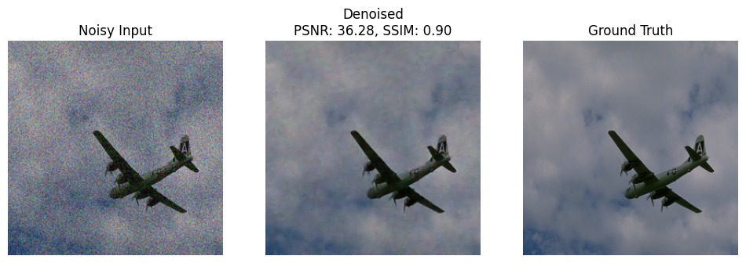

# 🚀 DenoiseNet

**Comparative Analysis of DnCNN vs. U-Net on CBSD68** 📊

Elevate your image-restoration game with this turnkey denoising suite! We harness two powerhouse CNNs—DnCNN and U-Net—to clean up Gaussian noise (σ = 35) on the CBSD68 benchmark, logging every metric on Weights & Biases.

---

## 📁 Repository Structure

```
├── README.md                                 
├── results/
│   ├── DnCNN.jpg      ← Noisy / Denoised / Ground Truth (DnCNN)
│   └── UNet.jpg      ← Noisy / Denoised / Ground Truth (UNet)
├── models/
│   ├── Denoising using DNCNN architecture.py                              
│   └── Denoising using UNet architecture.py                                                      
├── requirements.txt                          
├── data/
│   ├── noisy35/                              
│   └── original_png/                         
└── results/                                  
```
---

## ⚡ Quickstart

1. **Install dependencies**  
   ```bash
   pip install -r requirements.txt
   ```

2. **Prepare data directories**  
   ```bash
   mkdir -p data/{noisy35,original_png}
   # Populate with CBSD68 noisy (σ=35) and original PNG images
   ```

3. **Train DnCNN**  
   ```bash
   python "Denoising using DNCNN architecture.py" \
   ```

4. **Train U-Net**  
   ```bash
   python "Denoising using Unet architecture.py" \
   ```

---

## 📈 Results Snapshot

| Model  | PSNR (dB) | Δ vs. DnCNN | SSIM | Δ vs. DnCNN |
|:------:|:---------:|:-----------:|:----:|:-----------:|
| **DnCNN** | 36.28   | –           | 0.90 | –           |
| **U-Net** | 37.24   | +0.96       | 0.95 | +0.05       |

---

## 🖼️ Visual Examples

**Sample 1** (PSNR: 37.24, SSIM: 0.95)  


**Sample 2** (PSNR: 36.28, SSIM: 0.90)  


---

## 🔗 Weights & Biases Dashboards

- **DnCNN Run**: [View on W&B]([https://wandb.ai/ashishsingh73178-indian-institute-of-technology-patna/DnCNN-Image-Denoising](https://wandb.ai/ashishsingh73178-indian-institute-of-technology-patna/DnCNN-Image-Denoising/reports/DnCNN--VmlldzoxMjA3NzEyOQ?accessToken=mdnrgwjue2nhqkyvozesj8own5d9fzpu1h6cjrlzj6kzxn3rbr73anv5cb9v2nok))  
- **U-Net Run**: [View on W&B]([https://wandb.ai/ashishsingh73178-indian-institute-of-technology-patna/1e98v1nx](https://api.wandb.ai/links/ashishsingh73178-indian-institute-of-technology-patna/1e98v1nx))

---

## ✉️ Contact

**Rishu Kumar Singh**  
✉️ rishu_2301ee36@iitp.ac.in  
🔗 [GitHub: rishuSingh404](https://github.com/rishuSingh404)
```

